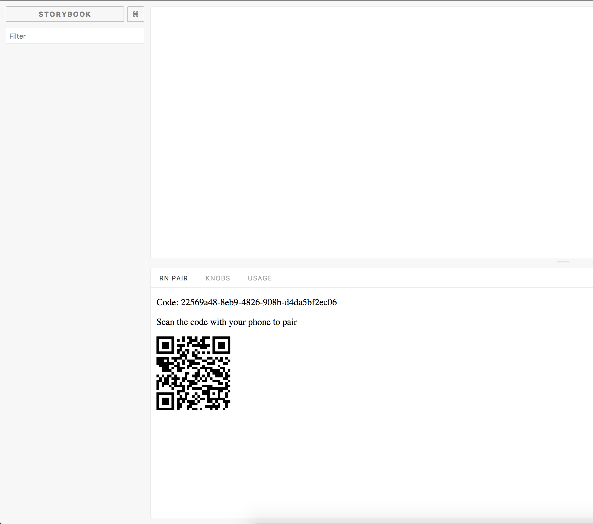

# Storybook Addon Qr Pair

[](https://greenkeeper.io/)
[](https://travis-ci.org/storybooks/storybook)
[](https://www.codefactor.io/repository/github/storybooks/storybook)
[](https://snyk.io/test/github/storybooks/storybook/8f36abfd6697e58cd76df3526b52e4b9dc894847)
[](https://bettercodehub.com/results/storybooks/storybook) [](https://codecov.io/gh/storybooks/storybook)
[](https://storybooks-slackin.herokuapp.com/)

Storybook for React Native supports hosting Storybook manager in a server. It supports multiple users but there is no way to
pair them. QR Pair addon displays necessary data to connect manager and preview.



## Getting Started

### Install:

```sh
npm i -D @storybook/addon-qr-pair
```

Then, add following content to `.storybook/addons.js`

```javascript
import '@storybook/addon-qr-pair/register';
```

### Reading the Qr Code:
React Native can be used in many different ways (expo, crna, with custom navigation solutions) so there is no common solution for qr code reading.
[https://github.com/Gongreg/RNStorybookClientExample/blob/master/App.js](Client example).
